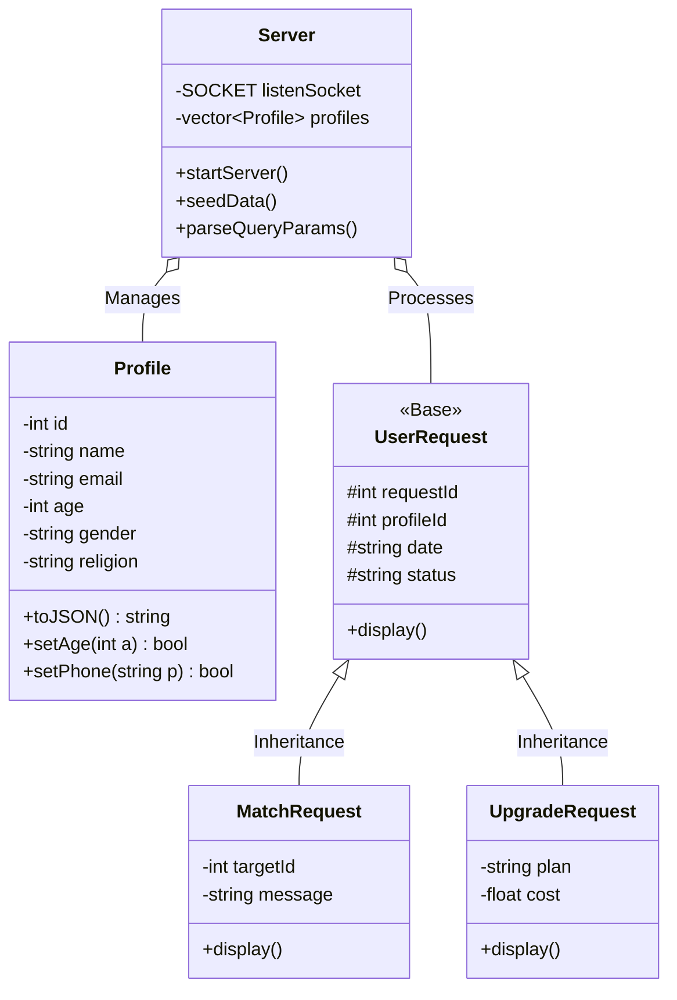

# Class Diagram - Matrimony Management System

This diagram represents the object-oriented structure of the backend C++ server.

```mermaid
classDiagram
    class Profile {
        -int id
        -string name
        -string email
        -int age
        -string gender
        -string religion
        +toJSON() string
        +setAge(int a) bool
        +setPhone(string p) bool
    }

    class UserRequest {
        <<Base>>
        #int requestId
        #int profileId
        #string date
        #string status
        +display()
    }

    class MatchRequest {
        -int targetId
        -string message
        +display()
    }

    class UpgradeRequest {
        -string plan
        -float cost
        +display()
    }

    class Server {
        -SOCKET listenSocket
        -vector~Profile~ profiles
        +startServer()
        +seedData()
        +parseQueryParams()
    }

    UserRequest <|-- MatchRequest : Inheritance
    UserRequest <|-- UpgradeRequest : Inheritance
    Server o-- Profile : Manages
    Server o-- UserRequest : Processes
```
