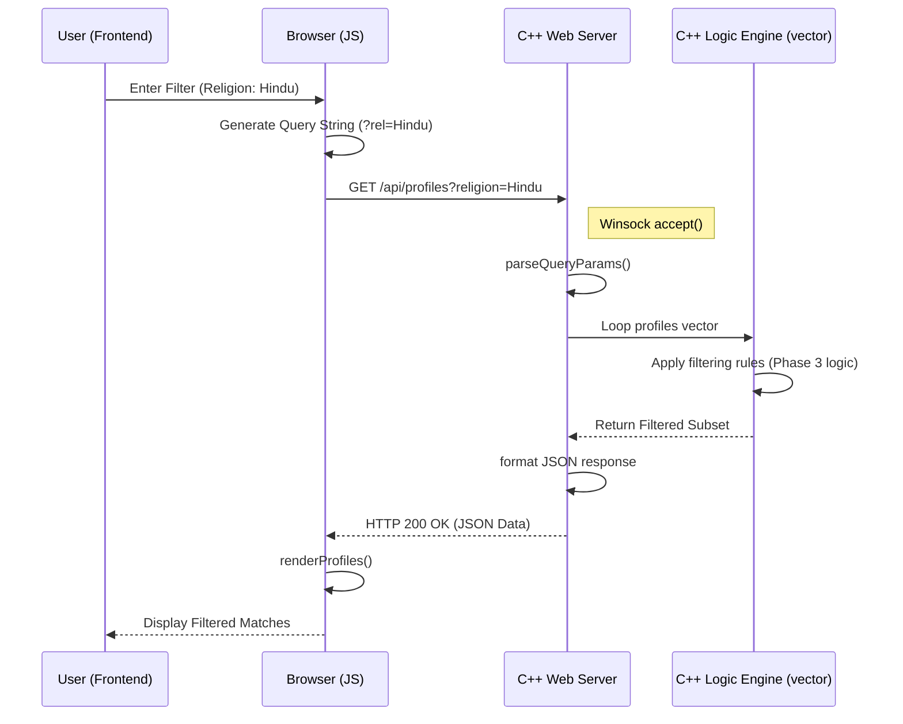

# Sequence Diagram - Search & Filter Operation

This diagram illustrates the flow of a single filtering request from the user's browser down to the C++ backend and back.

```mermaid
sequenceDiagram
    participant U as User (Frontend)
    participant B as Browser (JS)
    participant S as C++ Web Server
    participant E as C++ Logic Engine (vector)

    U->>B: Enter Filter (Religion: Hindu)
    B->>B: Generate Query String (?rel=Hindu)
    B->>S: GET /api/profiles?religion=Hindu
    Note right of S: Winsock accept()
    S->>S: parseQueryParams()
    S->>E: Loop profiles vector
    E->>E: Apply filtering rules (Phase 3 logic)
    E-->>S: Return Filtered Subset
    S->>S: format JSON response
    S-->>B: HTTP 200 OK (JSON Data)
    B->>B: renderProfiles()
    B-->>U: Display Filtered Matches
```
