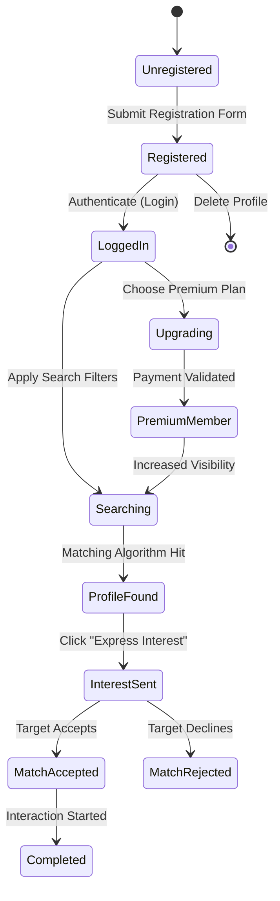

# State Diagram - Profile Lifecycle

This diagram demonstrates the different states a user profile can go through within the matrimony system.

```mermaid
stateDiagram-v2
    [*] --> Unregistered
    Unregistered --> Registered : Submit Registration Form
    Registered --> LoggedIn : Authenticate (Login)
    LoggedIn --> Searching : Apply Search Filters
    Searching --> ProfileFound : Matching Algorithm Hit
    ProfileFound --> InterestSent : Click "Express Interest"
    InterestSent --> MatchAccepted : Target Accepts
    InterestSent --> MatchRejected : Target Declines
    MatchAccepted --> Completed : Interaction Started
    
    LoggedIn --> Upgrading : Choose Premium Plan
    Upgrading --> PremiumMember : Payment Validated
    PremiumMember --> Searching : Increased Visibility
    
    Registered --> [*] : Delete Profile
```
